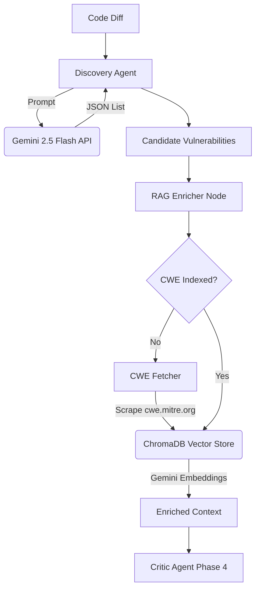

# Phase 3 Gothrough: Online ChromaDB RAG & Discovery Agent

## Completed: September 2026

---

## 1. What Was Built in Phase 3

Phase 3 implements the **Intelligence Intake Layer** by integrating real AI capabilities into the pipeline, replacing the Phase 2 stubs.

### Summary of Deliverables

| # | Component | File(s) | Description |
|---|-----------|---------|-------------|
| 1 | **Vector DB & Embeddings** | `backend/rag/chroma_service.py` | Configures ChromaDB `PersistentClient` and hooks into Google Gemini's `text-embedding-004` model. |
| 2 | **Online MITRE Scraper** | `backend/rag/cwe_fetcher.py` | Dynamically fetches live threat intelligence from `cwe.mitre.org` to feed the vector database on demand. |
| 3 | **Discovery Agent** | `backend/agents/discovery.py` | Invokes the **Gemini 2.5 Flash** model with a strict JSON system prompt to extract vulnerabilities directly from code diffs. |
| 4 | **Agent Integration** | `backend/agents/nodes.py` | Connects the new real functions into the DAG state machine. |
| 5 | **Test Suite** | `backend/tests/test_rag.py` | Mocked unit tests to verify RAG and Discovery components without exhausting API limits. |

---

## 2. Architecture Diagram



---

## 3. How to Run Phase 3

You do not need to install anything globally. Everything is contained within the backend virtual environment.

### 3.1 Start the Backend
Since this phase introduces real Gemini API calls, make sure your `.env` file has your `GEMINI_API_KEY`.

```bash
cd backend
.\venv\Scripts\activate.ps1
python app.py
```

### 3.2 Run the Unit Tests
The tests for Phase 3 use `unittest.mock` to ensure you aren't charged for API usage during CI/CD.

```bash
cd backend
.\venv\Scripts\activate.ps1
python -m pytest tests/test_rag.py -v
```

### 3.3 Trigger a Real Scan
With both the backend and frontend running, go to `http://localhost:3000` and click "Run Demo Scan". 
You will see the Discovery Agent pause while it calls the live Gemini 2.5 Flash API, and the RAG engine will pause while it scrapes MITRE and indexes the data into ChromaDB!
