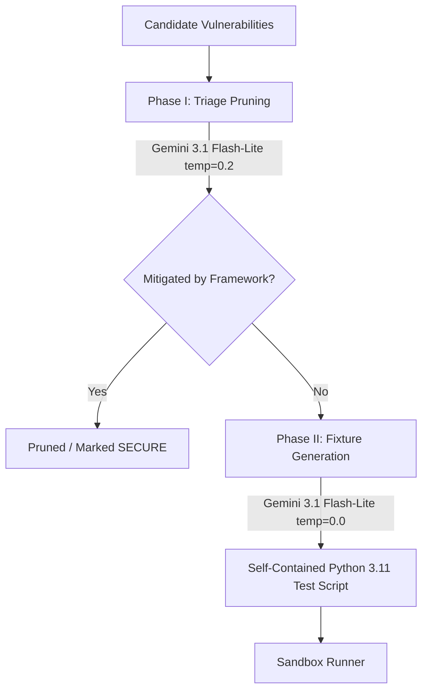

# Phase 4 Gothrough: Critic Agent & Sandbox Execution Harness

## Completed: September 2026
## Authors: Darshil Mendapara & Dhruv Parsana

---

## 1. What Was Built in Phase 4

Phase 4 replaces the Phase 2 stubs for the **Critic Agent** and **Sandbox Runner** with real, production-grade implementations. This is the core differentiator of VerifyFix — **execution grounding** — where AI-generated test fixtures are actually executed to prove whether a vulnerability is exploitable.

### Summary of Deliverables

| # | Component | File(s) | Description |
|---|-----------|---------|-------------|
| 1 | **Critic Agent** | `backend/agents/critic.py` | Gemini 3.1 Flash-Lite powered triage pruning (`temperature=0.2`) and test fixture generation (`temperature=0.0`). Includes self-healing retry support and fallback templates. |
| 2 | **Sandbox Runner** | `backend/sandbox/runner.py` | Dual-mode execution harness: Docker container isolation (60s timeout) with automatic fallback to restricted subprocess (30s timeout). |
| 3 | **Node Integration** | `backend/agents/nodes.py` | `node_critic` and `node_sandbox` now call real Critic Agent and Sandbox Runner instead of Phase 2 stubs. |
| 4 | **Test Suite** | `backend/tests/test_phase4.py` | 22 mocked unit tests covering triage, fixture generation, sandbox execution, verdict parsing, and retry loop logic. |
| 5 | **Documentation** | `Phase_4_Gothrough.md` | This document. |

---

## 2. Architecture

### 2.1 Critic Agent Pipeline



### 2.2 Sandbox Execution & Self-Healing Loop

```
   Critic Agent Generates Fixture
                 │
                 ▼
          Sandbox Runner
          (Docker or Subprocess)
                 │
      ┌──────────┴──────────┐
      ▼                     ▼
  Exit Code 0          Exit Code != 0 / Timeout
  (Parse stdout)       (Crash or Timeout)
      │                     │
      ├─ [VULNERABILITY     │
      │   CONFIRMED]        ▼
      │                HARNESS_ERROR
      ├─ [SECURE]           │
      │                     ▼
      ▼              Retry Count < 3?
  Proceed to         ├── Yes: Loop back to Critic with error traces
  Remediation        └── No:  Proceed to Remediation (INCONCLUSIVE)
```

### 2.3 Dual-Mode Sandbox

| Mode | When Used | Timeout | Isolation |
|------|-----------|---------|-----------|
| **Docker** | Docker daemon detected on host | 60 seconds | `--network none`, `--memory 256m`, `--cpus 0.5`, read-only mount, `python:3.11-slim` image |
| **Process Sandbox** | Docker unavailable (fallback) | 30 seconds | `tempfile.TemporaryDirectory()`, sensitive env vars stripped, isolated working directory |

### 2.4 Verdict Logic

| Exit Code | Stdout Contains | Timed Out | Verdict | Action |
|-----------|-----------------|-----------|---------|--------|
| 0 | `[VULNERABILITY_CONFIRMED]` | No | `VULNERABILITY_CONFIRMED` | Proceed to remediation ✅ |
| 0 | `[SECURE]` | No | `SECURE` | Proceed to remediation ✅ |
| Non-zero | *(traceback in stderr)* | No | `HARNESS_ERROR` | Retry (loop back to Critic) 🔄 |
| N/A | N/A | Yes | `HARNESS_ERROR` | Retry with "timed out" trace 🔄 |

---

## 3. Key Design Decisions

### 3.1 Python 3.11 Compatibility
All generated fixtures are explicitly constrained to Python 3.11 syntax via the system prompt. The Docker image uses `python:3.11-slim` to match. This ensures maximum compatibility and avoids issues with newer Python features.

### 3.2 Generous Timeouts
- **Docker:** 60 seconds — some fixtures involve database setup and multiple query executions.
- **Subprocess:** 30 seconds — adequate for standard library-only scripts.
- Timeouts trigger the **same retry loop** as crashes (both are `HARNESS_ERROR`). The Critic Agent receives a timeout-specific error trace and regenerates a simpler, faster fixture.

### 3.3 Self-Healing Feedback
When a fixture fails (crash or timeout), the error information is stored in `harness_error_traces` and fed back into the Critic Agent's system prompt on the next retry. This allows the AI to:
- Fix syntax/import errors from crash tracebacks.
- Simplify overly complex fixtures that timed out.
- Correct logic errors (e.g., database not seeded properly).

### 3.4 Graceful Fallbacks
- **No Gemini API key:** Triage skips pruning (keeps all candidates), fixture generation uses hardcoded templates for known CWEs.
- **No Docker:** Automatically falls back to process sandbox mode.
- **Unknown CWE:** Generic fallback fixture that reports the finding without automated exploitation.

---

## 4. How to Test

### 4.1 Run Unit Tests

```bash
cd backend
.\venv\Scripts\activate.ps1
python -m pytest tests/test_phase4.py -v
```

Expected: All 22 tests pass.

### 4.2 Run a Real Scan

With both backend and frontend running:

```bash
# Terminal 1: Backend
cd backend
.\venv\Scripts\activate.ps1
python app.py

# Terminal 2: Frontend
cd frontend
npm run dev
```

Go to `http://localhost:3000` and click "Run Demo Scan". You will see:
1. The **Critic Agent** calling Gemini for triage pruning and fixture generation.
2. The **Sandbox Runner** executing the generated fixture (in subprocess mode if Docker is not running).
3. The **self-healing loop** firing if the fixture crashes or times out.
4. The final scan result with `VULNERABILITY_CONFIRMED` verdicts.

---

## 5. File Tree After Phase 4

```
VerifyFix/
├── backend/
│   ├── agents/
│   │   ├── __init__.py
│   │   ├── state.py
│   │   ├── nodes.py                        # [UPDATED] Real critic + sandbox integration
│   │   ├── graph.py
│   │   ├── discovery.py
│   │   └── critic.py                       # [NEW] Gemini-powered triage + fixture generation
│   ├── sandbox/
│   │   ├── __init__.py                     # [NEW] Package init
│   │   └── runner.py                       # [NEW] Dual-mode execution harness
│   ├── rag/
│   │   ├── __init__.py
│   │   ├── chroma_service.py
│   │   └── cwe_fetcher.py
│   ├── services/
│   │   ├── __init__.py
│   │   └── mongodb.py
│   ├── tests/
│   │   ├── test_api.py
│   │   ├── test_dag.py
│   │   ├── test_rag.py
│   │   └── test_phase4.py                  # [NEW] 22 unit tests for Phase 4
│   ├── app.py
│   ├── config.py
│   └── requirements.txt
├── frontend/
│   └── ...
├── Phase_4_Gothrough.md                    # [NEW] This document
├── Phase_4_Critic_Agent_and_Sandbox_Harness_Plan.md
├── Phase_3_Gothrough.md
├── Phase_2_Gothrough.md
└── README.md
```

---

## 6. What's Next (Phase 5 Preview)

Phase 5 will implement the **Senior Analyst Remediation Agent** and **DOCX Report Generation**:
- **Agent 4 (Senior Analyst):** Replace the remediation stub with a real Gemini-powered root-cause analyzer that generates patch diffs and defense-in-depth guidance.
- **DOCX Report:** Generate a professional vulnerability assessment report as a downloadable `.docx` file with executive summary, findings table, and remediation recommendations.
