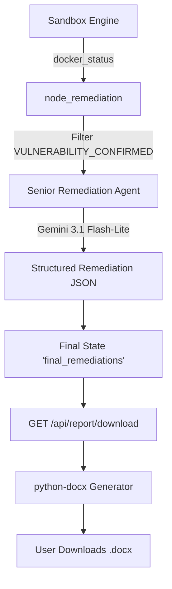

# Phase 5 Gothrough: Senior Analyst Remediation & DOCX Report Generation

## Completed: September 2026
## Authors: Darshil Mendapara & Dhruv Parsana

---

## 1. What Was Built in Phase 5

Phase 5 introduces the final stage of the VerifyFix backend pipeline. Once vulnerabilities are confirmed by the Sandbox Engine, they are passed to the **Senior Remediation Analyst Agent**. This agent analyzes the root cause and generates defense-in-depth advice along with a patch. Finally, all scan results are compiled into a professional Microsoft Word document (`.docx`) that can be downloaded by the user.

### Summary of Deliverables

| # | Component | File(s) | Description |
|---|-----------|---------|-------------|
| 1 | **Senior Remediation Agent** | `backend/agents/remediation.py` | Agent 4 uses **Gemini 3.1 Flash-Lite** (`temperature=0.4`) to analyze execution traces and original source diffs, returning a structured JSON containing a root cause analysis, git diff patch, and architectural defense-in-depth advice. |
| 2 | **Node Integration** | `backend/agents/nodes.py` | `node_remediation` now aggregates all `VULNERABILITY_CONFIRMED` items, maps them to the original vulnerabilities, and invokes the Remediation Agent. |
| 3 | **Report Generator Service** | `backend/services/report_generator.py` | Uses `python-docx` to generate an executive-style `.docx` document containing scan metrics, execution proofs, and the remediation advice. |
| 4 | **Download API Endpoint** | `backend/app.py` | Added `GET /api/report/download?scan_id=<ID>` which serves the generated DOCX file directly as an attachment stream. |
| 5 | **Test Suite** | `backend/tests/test_report.py` | Unit tests for both the document generator and the remediation agent. |

---

## 2. Architecture

### 2.1 The Remediation Flow


### 2.2 Report Generator Output
The generated `.docx` file contains:
1. **Cover & Metadata:** Title, Repository, Scan ID, Timestamps, Authors.
2. **Executive Summary:** A high-level overview of total candidates, pruned false positives, and confirmed exploits.
3. **Detailed Findings & Remediation:** For each confirmed vulnerability:
   - Severity and Location.
   - Root Cause Analysis.
   - Execution Proof (the exact terminal output from the sandbox).
   - Recommended Patch (unified git diff).
   - Defense in Depth (architectural bullet points).

---

## 3. Key Design Decisions

### 3.1 Using `gemini-3.1-flash-lite` with `temperature=0.4`
We use `gemini-3.1-flash-lite` for speed and consistency. The `temperature=0.4` setting provides a balance: it is creative enough to generate broad architectural "defense in depth" advice, but strict enough to maintain valid JSON schema compliance and accurate git diffs.

### 3.2 In-Memory Document Generation
The `report_generator.py` service creates the document in an in-memory `io.BytesIO` stream. This prevents disk I/O bottlenecks and avoids filling the server's hard drive with temporary report files. The stream is sent directly to the client via Flask's `send_file`.

### 3.3 Fallback Mechanism
If the `GEMINI_API_KEY` is missing or the API errors out, the system falls back to generic templates (with specific logic for CWE-89 SQL Injection) ensuring the pipeline never completely breaks.

---

## 4. How to Test

### 4.1 Run Unit Tests
```bash
cd backend
.\venv\Scripts\activate.ps1
python -m pytest tests/test_report.py -v
```

### 4.2 Run an End-to-End Test
With both backend and frontend running:
1. Trigger a "Run Demo Scan" from `http://localhost:3000`.
2. Wait for the scan to finish (you'll see the Senior Analyst step log in the backend terminal).
3. Open your browser and navigate to:
   `http://localhost:5000/api/report/download?scan_id=<THE_SCAN_ID>`
   (You can find the `scan_id` in the URL or logs).
4. Download and open the `VerifyFix_Audit_Report_<ID>.docx` file in Microsoft Word or Google Docs.

---

## 5. File Tree After Phase 5

```
VerifyFix/
├── backend/
│   ├── agents/
│   │   ├── __init__.py
│   │   ├── state.py
│   │   ├── nodes.py                        # [UPDATED] node_remediation
│   │   ├── graph.py
│   │   ├── discovery.py
│   │   ├── critic.py
│   │   └── remediation.py                  # [NEW] Senior Analyst Agent
│   ├── sandbox/
│   │   ├── __init__.py
│   │   └── runner.py
│   ├── rag/
│   │   ├── __init__.py
│   │   ├── chroma_service.py
│   │   └── cwe_fetcher.py
│   ├── services/
│   │   ├── __init__.py
│   │   ├── mongodb.py
│   │   └── report_generator.py             # [NEW] python-docx generator
│   ├── tests/
│   │   ├── test_api.py
│   │   ├── test_dag.py
│   │   ├── test_rag.py
│   │   ├── test_phase4.py
│   │   └── test_report.py                  # [NEW] Phase 5 unit tests
│   ├── app.py                              # [UPDATED] GET /api/report/download
│   ├── config.py
│   └── requirements.txt
├── frontend/
│   └── ...
├── Phase_5_Gothrough.md                    # [NEW] This document
├── Phase_4_Gothrough.md
├── Phase_3_Gothrough.md
├── Phase_2_Gothrough.md
└── README.md
```

---

## 6. What's Next (Phase 6 Preview)

Phase 6 will focus on the **Frontend React Flow Dashboard**. 
We will integrate a rich visual DAG interface using `React Flow` to visualize the pipeline (Discovery -> RAG -> Critic -> Sandbox -> Remediation) in real-time, connecting to the backend SSE stream.
